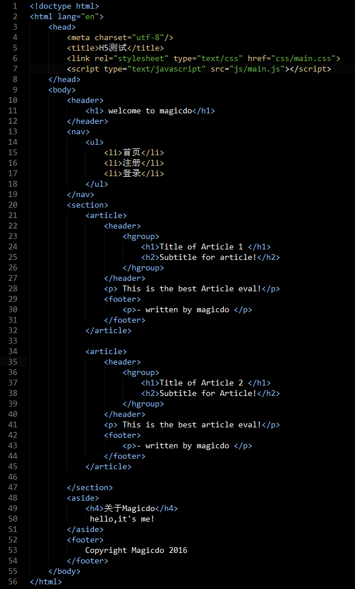
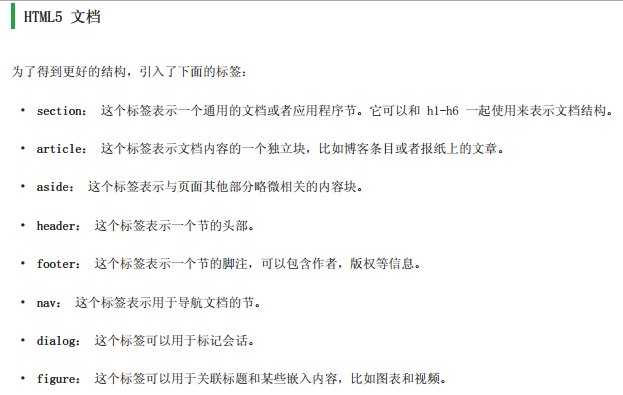
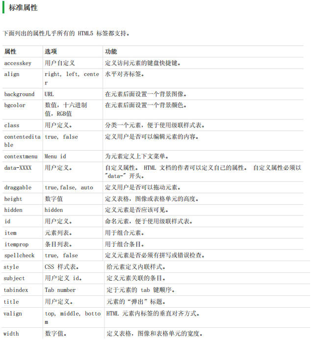

### 一.H5的新特性
		1.用于绘画的canvas元素
		2.用于媒介回放的video和audio元素
		3.对本地离线存储的更好的支持
		4.新的特殊内容元素，比如article、footer、header、nav、section
		5.新的表单控件：比如calendar、date、time、email、url、search
##### 新特性

##### 二.一个基本的h5页面

#### 三.h5属性

#### 四.h5的事件

		